# Отчет по лабораторной работе №3
**Дисциплина:** Операционные системы

**Выполнил:** Тажитдинов Кирилл

**Группа:** СА-1-25


---

## Раздел 2.1. Управление учетными записями пользователей

### Шаг 2.1.1. Создание нового пользователя
Я создал в системе нового пользователя `ivanov` с помощью команды `useradd`. Использовал ключи для автоматического создания домашней папки, выбора оболочки Bash и добавления в группу администраторов `sudo`.
```bash
sudo useradd -m -s /bin/bash -c "Иван Иванович" -G sudo ivanov
```


### Шаг 2.1.2. Установка пароля
Чтобы активировать созданную учетную запись, я задал для неё пароль с помощью утилиты `passwd`:
```bash
sudo passwd ivanov
```
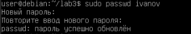

### Шаг 2.1.3. Изменение командной оболочки (Способ 1 и Способ 2)
Я протестировал два подхода к смене интерпретатора команд для пользователя.
* **Способ 1:** Использование специализированной утилиты `chsh`.
```bash
sudo chsh -s /bin/zsh ivanov
```
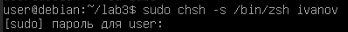

* **Способ 2:** Прямое ручное редактирование конфигурационного файла с помощью безопасной утилиты `vipw`. В открывшемся редакторе Nano я перешел в конец файла и вручную заменил строку пользователя.
```bash
sudo vipw
```
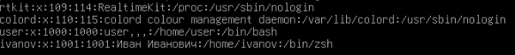

### Шаг 2.1.4. Установка non-login shell (Блокировка интерактивного входа)
Я создал системного пользователя `service_user` и заблокировал ему доступ к консоли, установив оболочку-заглушку `/usr/sbin/nologin`. При попытке войти под ним система выдала ошибку проверки подлинности.
```bash
sudo usermod -s /usr/sbin/nologin service_user
```
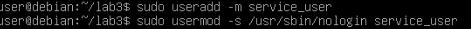

### Шаг 2.1.5. Удаление пользователей
Я проверил два варианта удаления учетных записей из системы:
* **Шаг 2.1.5.1:** Простое удаление пользователя `service_user` без очистки диска.
```bash
sudo userdel service_user
```


* **Шаг 2.1.5.2:** Полное удаление пользователя `ivanov` вместе с его домашним каталогом с помощью флага `-r`.
```bash
sudo userdel -r ivanov
```
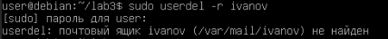

---

## Раздел 2.2. Управление правами доступа к файлам

Для тестов я заново добавил пользователя `ivanov`, создал файлы `script.sh`, `config.ini` и каталог `/home/ivanov/.ssh/`.

### Шаг 2.2.1. Изменение владельца файла
Я применил команду `chown` для смены владельца и группы созданных тестовых объектов, передав права пользователю `ivanov`.
```bash
sudo chown ivanov document.txt
sudo chown ivanov:ivanov document.txt
```
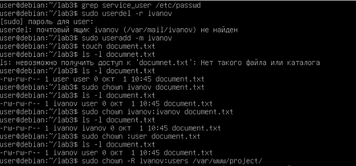

### Шаг 2.2.2. Изменение прав доступа (Числовая нотация)
Я выставил точные права для файлов и папок в соответствии с таблицей из методички:
```bash
chmod 755 script.sh
chmod 644 config.ini
sudo chmod 700 /home/ivanov/.ssh/
```
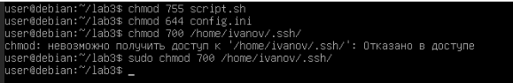

### Шаг 2.2.3. Специальные биты безопасности
Я изучил и проверил работу особых режимов доступа в Linux:
* **Шаг 2.2.3.1 (SUID):** Бит запуска от имени владельца. Проверил его наличие на системной утилите `passwd`.
```bash
chmod u+s /usr/bin/passwd
ls -l /usr/bin/passwd
```


* **Шаг 2.2.3.2 (SGID):** Бит наследования группы для каталога. Создал общую папку и активировал на ней этот режим.
```bash
sudo chmod g+s /shared/directory
```
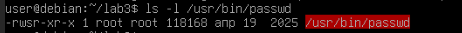

* **Шаг 2.2.3.3 (Sticky bit):** Защита файлов от удаления чужими пользователями. Проверил его работу в стандартной системной папке `/tmp`.
```bash
ls -ld /tmp
```
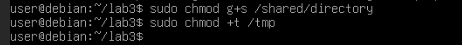

---

## Раздел 2.3. Персонализация консоли через .bashrc

Я настроил личную среду окружения, отредактировав файл `nano ~/.bashrc` в своей домашней папке.

### Шаг 2.3.1. Изменение приглашения командной строки (Цветной интерфейс)
Я добавил переменную PS1, которая разукрасила терминал и вывела текущее время в квадратных скобках перед вводом команд.
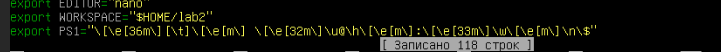

### Шаг 2.3.2. Настройка сокращений (Алиасы)
Я прописал удобные алиасы для быстрого перехода на уровень выше (`..`) и детального вывода списка файлов (`ll`).
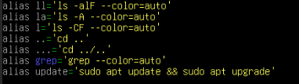

### Шаг 2.3.3 и 2.3.4. История команд и применение изменений
Я задал увеличенный размер хранения истории команд и добавил отображение даты/времени для каждой операции. После этого перезапустил конфигурацию командой `source`.
```bash
source ~/.bashrc
```
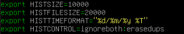

---

## Раздел 2.4. Настройка внешнего вида Vim и плагины

### Шаг 2.4.1 и 2.4.2. Базовая конфигурация текстового редактора
Я создал файл `nano ~/.vimrc` и добавил туда основные опции: нумерацию строк (`set number`), подсветку синтаксиса (`syntax on`), цветовую схему `desert` и интеграцию мыши (`set mouse=a`).
Так как по документации команд было слишком много, я сократил их количество.
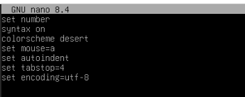

### Шаг 2.4.3. Установка менеджера плагинов Vundle
Я попытался склонировать менеджер дополнений Vundle с сайта GitHub. В процессе выполнения команды git clone возникла сетевая ошибка Could not resolve host: github.com. 
**Причина ошибки:** Как я выяснил, вм изолирована от интернета. При наличии сетевого доступа данный шаг автоматически скачивает Vundle в папку `~/.vim/bundle/`, позволяя установить любые плагины.
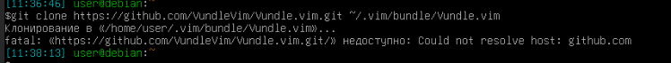

---

## Заключение
В ходе работы я освоил администрирование пользователей и прав доступа в Linux. Научился разделять права с помощью числовых масок и специальных битов (`SUID`/`SGID`/`Sticky`). Также я успешно кастомизировал консоль Bash и редактор Vim, сделав их удобными для повседневного использования.

## 5. Контрольные вопросы

### 1. Какой формат имеет файл /etc/passwd? Объясните назначение каждого поля.
Файл текстовый. Каждый пользователь занимает одну строку из семи полей, разделенных двоеточием. Назначение полей: логин, заглушка пароля (x), ID пользователя (UID), ID группы (GID), комментарий (ФИО), домашняя папка, командная оболочка.

### 2. Чем отличаются команды useradd и adduser? Какая из них предпочтительнее для начинающих администраторов?
Команда useradd это низкоуровневая утилита. Она просто создаёт учетку, а все параметры (папку, оболочку) нужно прописывать ключами вручную. Команда adduser это интерактивный скрипт. Он сам пошагово спрашивает пароль, ФИО и автоматически создаёт домашний каталог. Для начинающих предпочтительнее adduser.

### 3. Какие значения shell используются для non-login пользователей? В чем разница между /sbin/nologin и /bin/false?
Используются оболочки-заглушки: `/sbin/nologin` или `/bin/false`. Разница в том, что `/sbin/nologin` при попытке входа вежливо пишет, что аккаунт недоступен, и закрывает сессию. А `/bin/false` просто молча закрывает соединение с кодом ошибки.

### 4. Опишите алгоритм безопасного изменения shell пользователя в файле /etc/passwd. Почему нельзя использовать обычный текстовый редактор?
Нужно использовать команду `sudo vipw`. Обычный редактор нельзя использовать потому, что он не проверяет синтаксис на ошибки. Если случайно сдвинуть двоеточие или опечататься, система сломается и никто не сможет войти. Утилита `vipw` блокирует файл от одновременных правок другими админами и проверяет текст перед сохранением.

### 5. Какие права доступа соответствуют числовым значениям 644, 755, 700? Расшифруйте каждое.
Цифры складываются из: чтение (4), запись (2), выполнение (1).
* 644: владельцу можно читать и изменять, группе и остальным можно только читать. Стандарт для обычных файлов документов.
* 755: владельцу доступно всё, группе и остальным можно только читать и запускать. Стандарт для скриптов и программ.
* 700: полный доступ есть только у владельца. Для остальных файл полностью закрыт и скрыт. Стандарт для секретных ключей.

### 6. В чем разница между командами chown и chgrp?
Команда chown меняет владельца файла (а также может поменять и группу, если написать через двоеточие). Команда chgrp умеет менять исключительно группу владельцев файла.

### 7. Что такое SUID, SGID и Sticky bit? Приведите примеры их практического применения.
* SUID: запускает программу с правами её владельца (обычно root). Пример: утилита смены пароля passwd.
* SGID: заставляет новые файлы внутри папки автоматически наследовать группу этой папки, а не создателя. Пример: общая рабочая папка отдела.
* Sticky bit: разрешает создавать файлы всем в общей папке, но удалять чужие файлы запрещено, только свои. Пример: системная папка /tmp.

### 8. Как применить изменения в файле .bashrc без перезагрузки системы?
Нужно выполнить в терминале команду: `source ~/.bashrc`.

### 9. Объясните назначение переменной PS1. Какие специальные символы используются для отображения текущего каталога, имени пользователя и имени хоста?
Переменная PS1 отвечает за внешний вид, структуру и цвет строки приглашения в терминале, которую ты видишь перед курсором. Специальные символы:
* `\u` выводит имя текущего пользователя.
* `\h` выводит короткое имя компьютера в сети.
* `\w` показывает полный путь к текущей рабочей папке (домашняя папка при этом сокращается до значка ~).

### 10. Перечислите основные настройки, которые можно задать в файле ~/.vimrc для повышения удобства работы системного администратора.
* `set number` включает нумерацию строк слева.
* `syntax on` включает цветную подсветку кода.
* `colorscheme` меняет общую тему оформления редактора.
* `set mouse=a` разрешает кликать мышкой по тексту и крутить колесико прямо в консоли.
* `set tabstop=4` настраивает ширину отступа Tab равной 4 пробелам.

### 11. Как удалить пользователя вместе с его домашним каталогом и почтовым ящиком?
Для этого нужно запустить команду удаления с флагом полной очистки -r:

sudo userdel -r имя_пользователя

### 12. Какие требования предъявляются к паролям пользователей в современных дистрибутивах Linux?
Пароль обязательно должен быть сложным для подбора. Обычно система требует длину не менее 8 символов, отсутствие простых слов из словаря, а также использование букв разных регистров (строчные и заглавные), цифр и спецсимволов.
